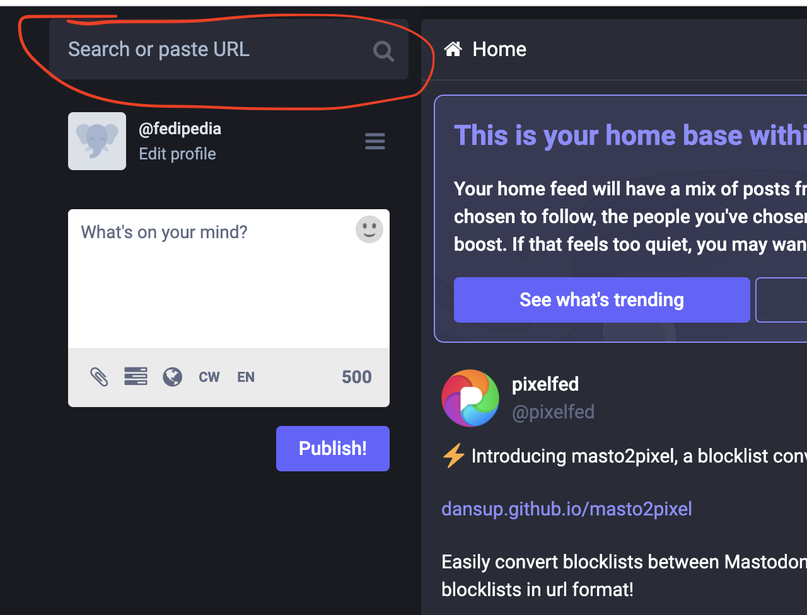

# Following people outside of Mastodon

Mastodon is a part of the Fediverse.

This means that you can follow someone on a different social networking site, as long as that other site is on the Fediverse as well.

Following people with Mastodon involves pasting the account address in the search box.

