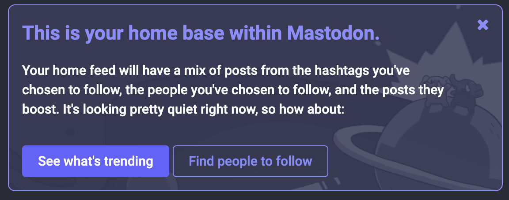
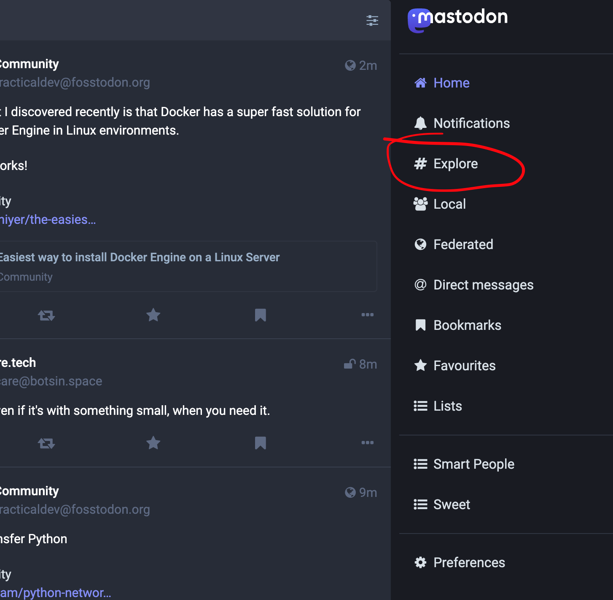
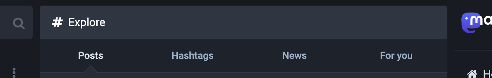
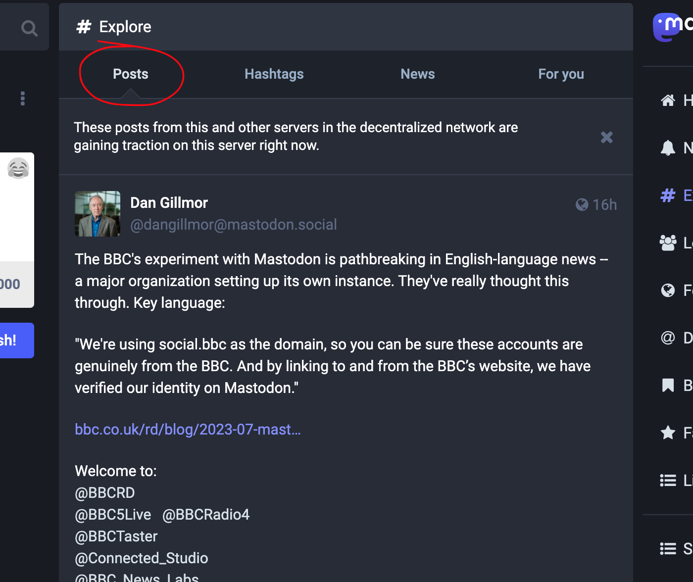
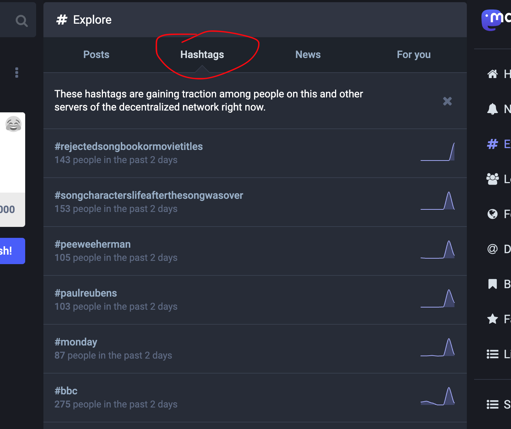
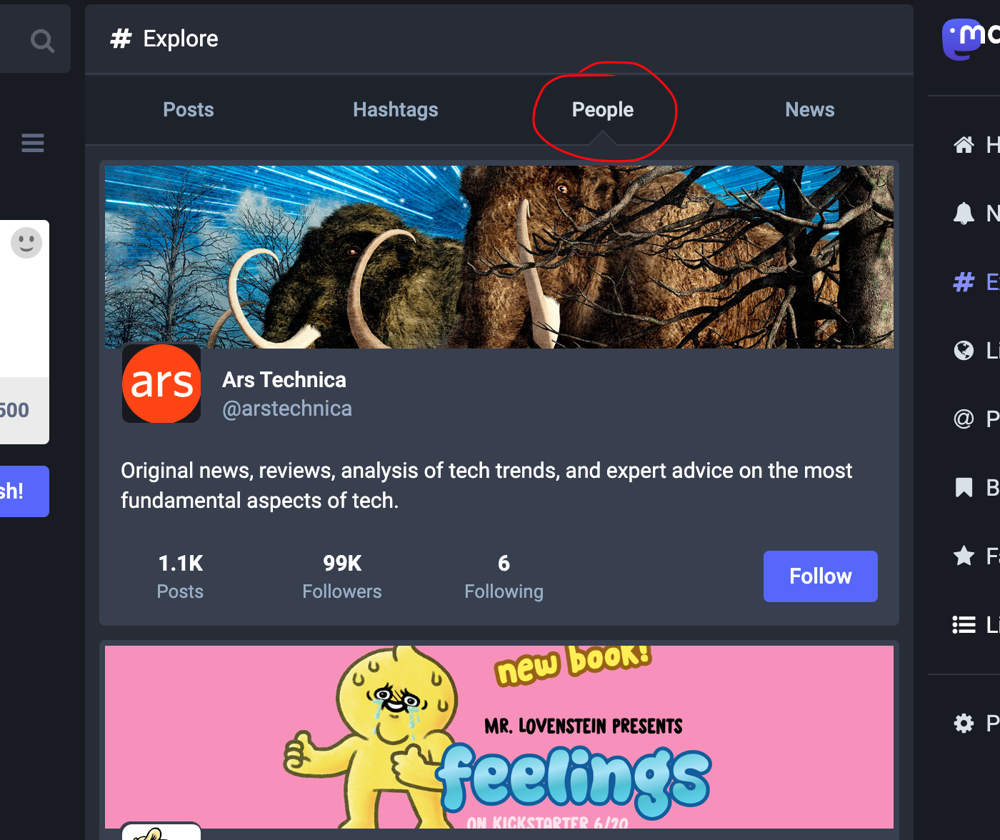
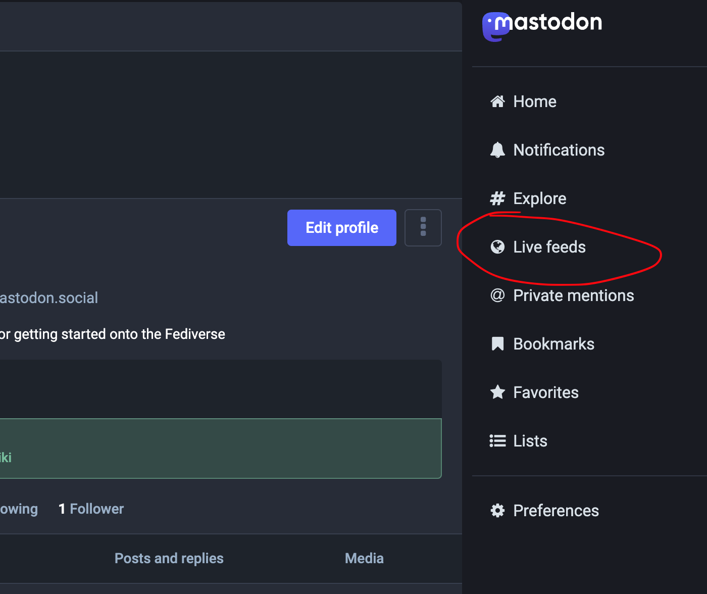
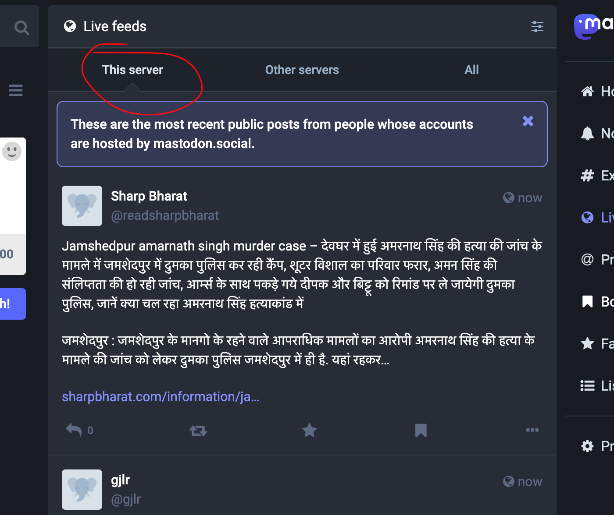
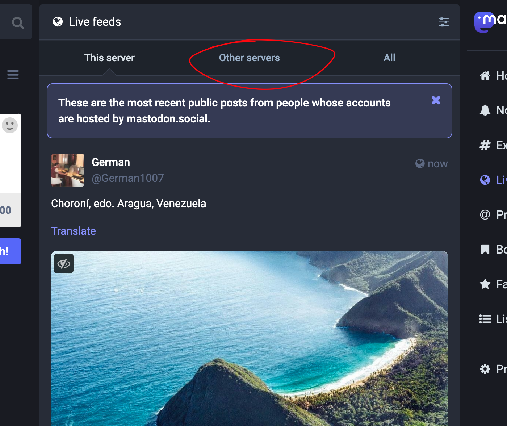
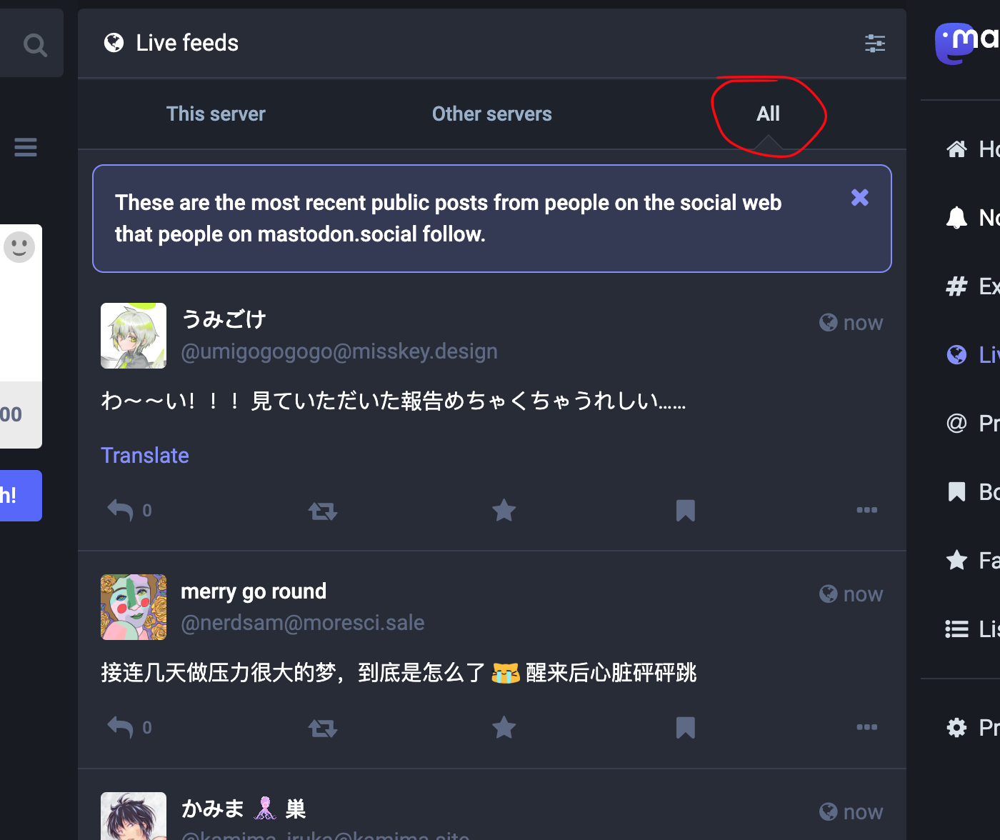

# Following Accounts on Mastodon Web

## When you first sign up

When you first create your Mastodon account on a server, the first thing to pop up on your home timeline should be a notice with the following message:

Click the button that reads "Find people to follow".

From there, you should be presented with a list of people that you could consider following.

## Finding people to follow

So you effectively lost the introductory notice from earlier, because you followed a few people, posted a bit, and now the notice is gone.

How do you go about finding people to follow?

There are several options:

- the "Explore" tab
- "Live feeds"
	- Local server
	- Other other servers

### The Explore tab

Go to the explore tab by clicking the "Explore" link on the sidebar.

You should then end up with a page that has the following navigation bar at the top:

The explore tab has 3 additional tabs from which you can discover acccounts to follow:

- Posts
- Hashtags
- People

It has a fourth tab, that that fourth one doesn't have any posts from people who you can follow, so we will ignore it, for now.

#### Posts

The posts tab shows trending posts from anyone on the Fediverse, not just the server that you are on.

This tab is an excellent place to find people to follow, since it is a place likely containing posts from people who you *don't* yet follow.

In order to follow anyone on there, simply click either the profile picture, their name, or their account address to go to their profile.

Once there, you should be able to click the follow button, and follow the account.

#### Hashtags

The hashtags tab shows you a list of trending hashtags across the Fediverse. That tab contains no post from anyone, but you can click on any of the hashtags that you want.

Once you clicked on a hash tag, you should be directed to a page, that contains posts from people who post content that contains the hashtag that you clicked on.

Click on either the name, profile picture, or account address of the author of a post, and you should be brought to their profile. Fron there, you should be able to click the "Follow button"

#### People

The people tab is quite simply a list of accounts that you can follow. Click the follow button.

### Live feeds

The Live feed has 3 tabs:

- This server
- Other servers
- All

#### This server

The "This server" tab contains posts from people who currently reside on the server that you signed up for your Mastodon account.

You should be able to click the profile picture, name, or account address of the author of a particular post, and be brought to their profile page.

From there, you should be able to follow the account that you desire to follow.

#### Other servers

The "Other servers" tab contains posts from people who currently reside on other servers on the Fediverse, beyond just the one that you signed up for.

You should be able to click the profile picture, name, or account address of the author of a particular post, and be brought to their profile page.

From there, you should be able to follow the account that you desire to follow.

#### All

The "All" tab contains posts from both the server that you are signed up from, and other servers on the Fediverse.

You should be able to click the profile picture, name, or account address of the author of a particular post, and be brought to their profile page.

From there, you should be able to follow the account that you desire to follow.

## Following a public vs private profile

Not all profiles are open to be followed; some accounts require you to request to follow, rather than to follow them outright.

If their profile is open, clicking the "Follow" button should have you follow their profile.

But if their profile is closed, clicking the "Follow" button will send a request to follow the profile.

If the account holder agrees to let you follow them, they will let you follow them.