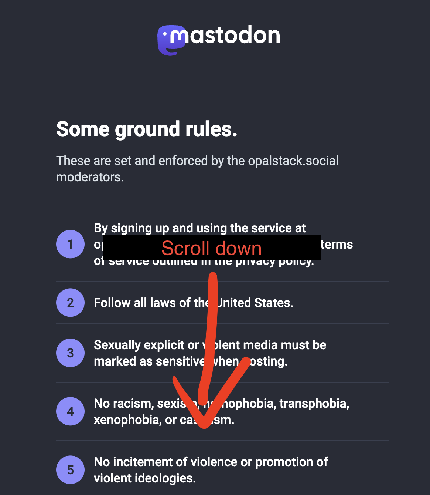
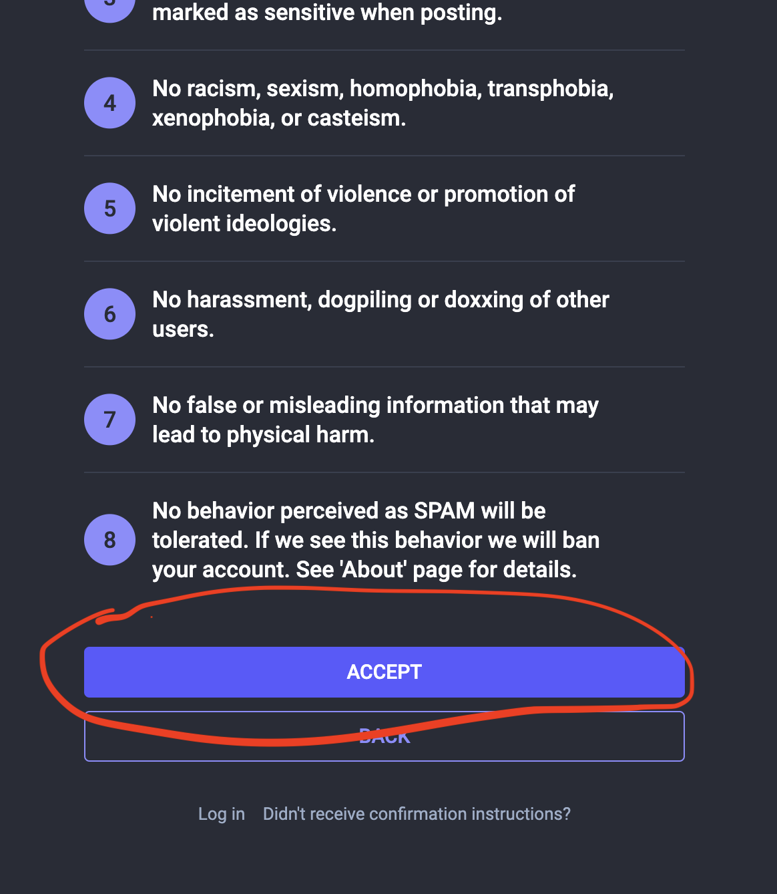
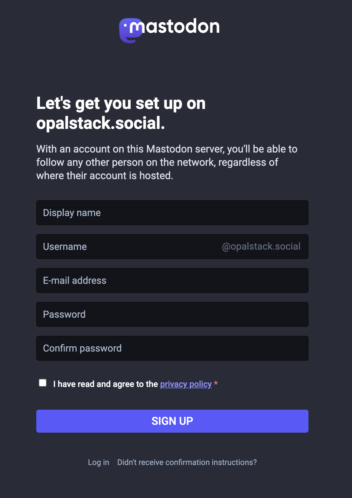
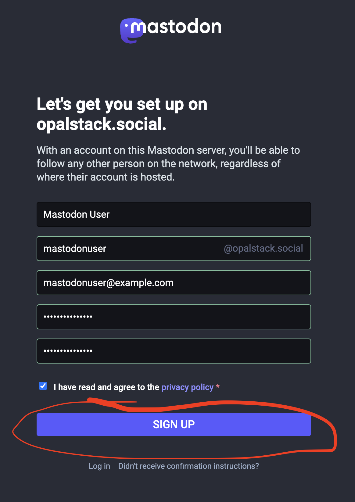
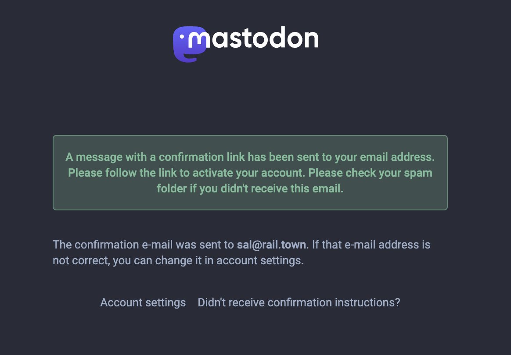
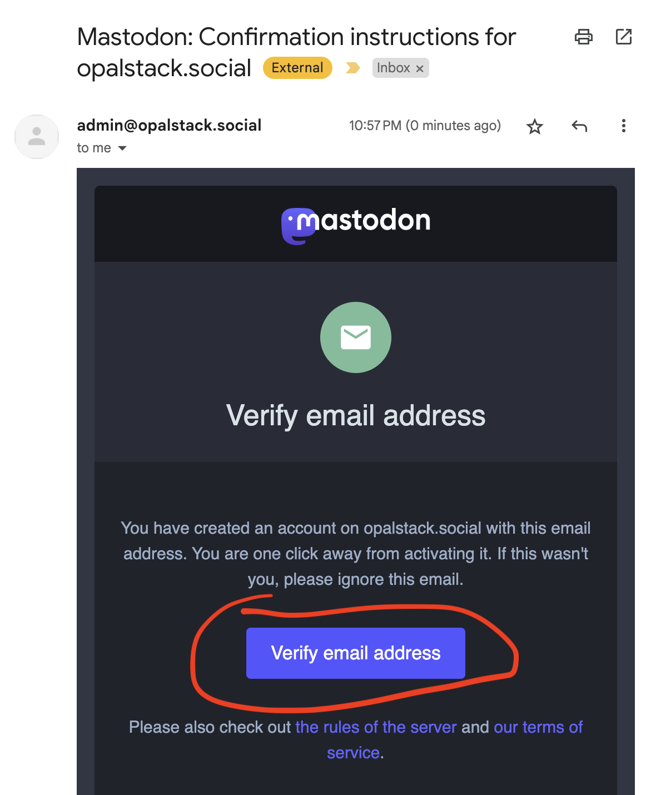
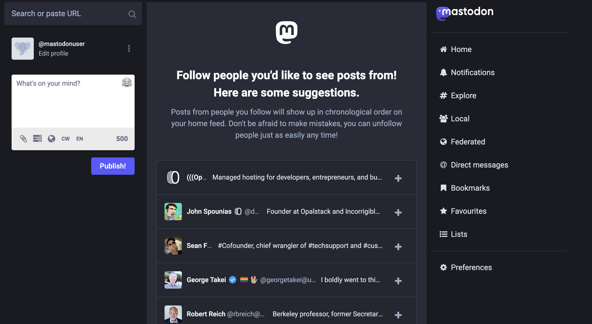

# How to Join Mastodon From the Web

## Step 1

Click the button below, and follow the rest of the instructions.

import {ServerSelector} from '../../../src/components/ServerSelector'

<ServerSelector />

Scroll down.

## Step 2

Click the big button that reads "Accept".

## Step 3

You should see the following form.

Fill it out.

## Step 4

Once filled out, click the big button that reads "Sign Up"

## Step 5

You should then be redirected to the notice that tells you to check your email.

## Step 6

Check your email.

## Step 7

Done.

