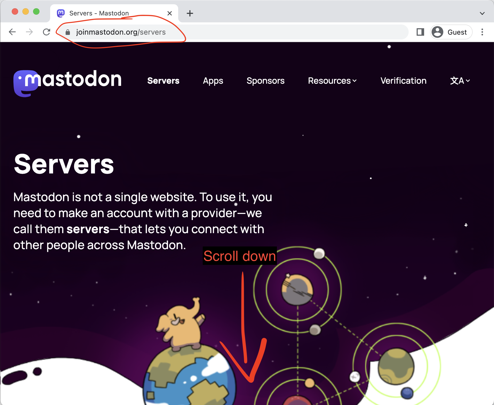
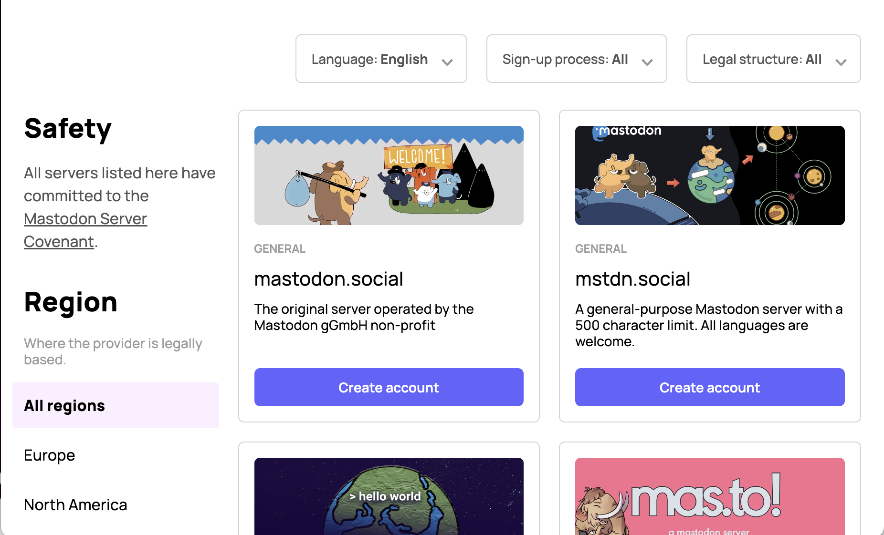
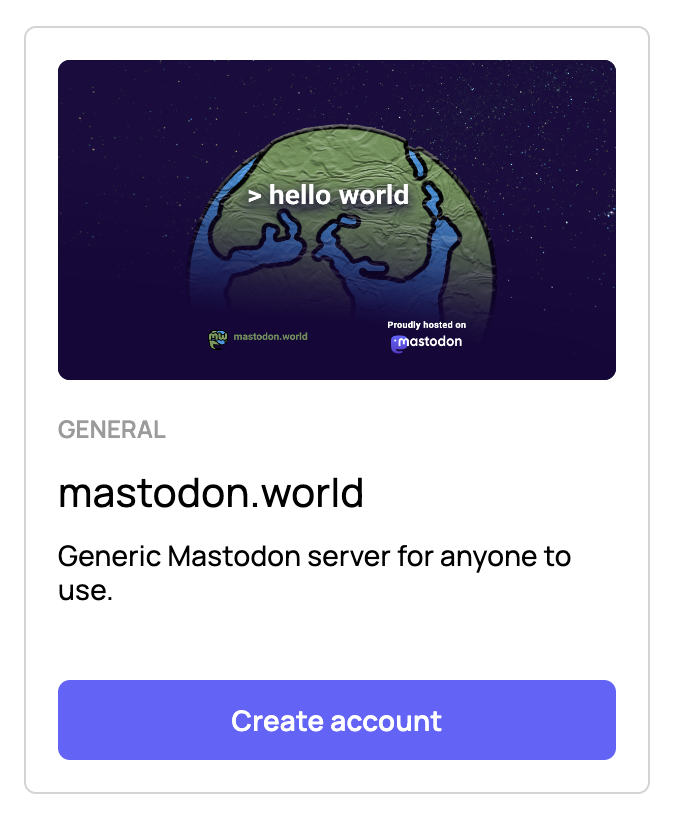
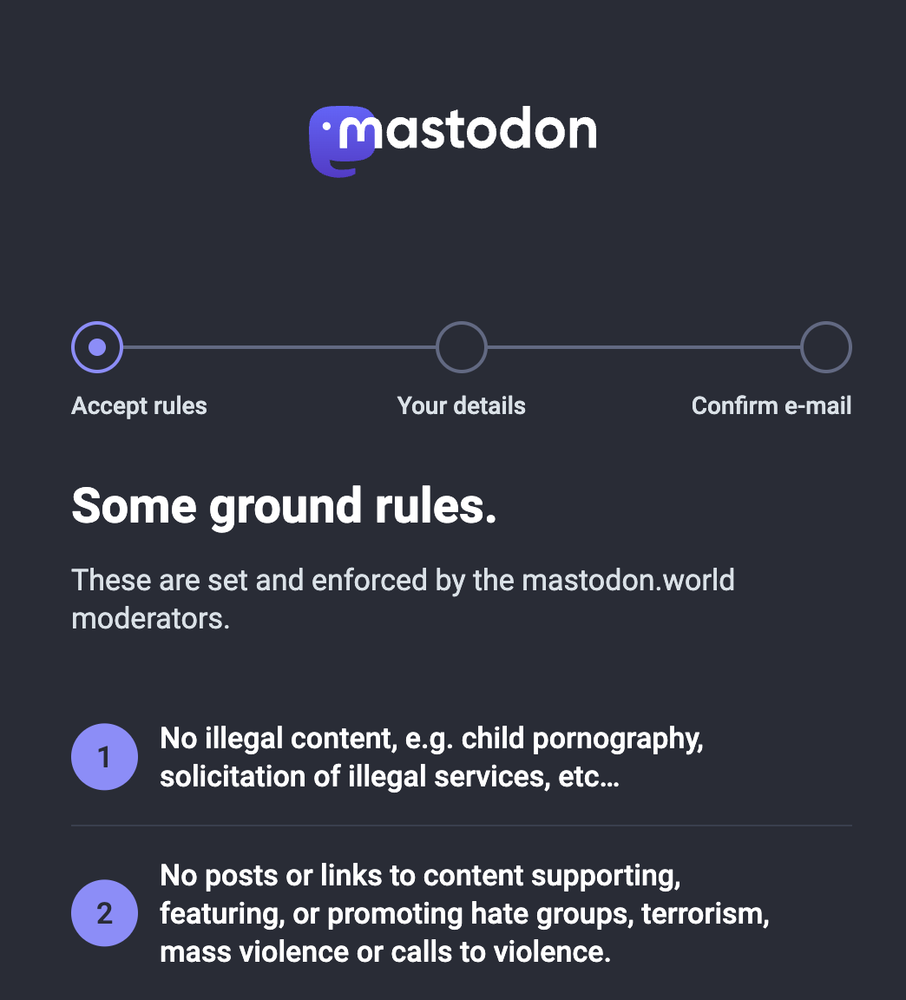

# How to Join Mastodon From the Web

Like [Twitter](https://en.wikipedia.org/wiki/Twitter) and [Threads](https://en.wikipedia.org/wiki/Threads_(social_network)), [Mastodon](https://joinmastodon.org/) is a [microblogging](/docs/glossary/microblogging) [platform](/docs/glossary/platform), allowing you to [post](/docs/glossary/post) short text [articles](/docs/glossary/article) that typically omit the need to include a title.

Since Mastodon is a [software](/docs/glossary/software), and not a [service](/docs/glossary/service), the general idea is for you to join a [social network](/docs/glossary/social-network.md) that *uses* Mastodon as the software that will give you a social networking and microblogging experience.

That said, if you are specifically looking for a social networking platform that *uses* Mastodon, then you will first need to find an [instance](/docs/glossary/instance) to join.

## Finding an Instance

Other than being recommended by a friend to join a specific running Mastodon instance, the main Mastodon website has a list of instances that are currently running, along with a blurb to perhaps describe what the instance is, why it exists, and who is the intended [audience](/docs/glossary/audience).

**Check out the list over at [joinmastodon.org/servers](https://joinmastodon.org/servers)**.

Do note that once you land on the page, you will have to scroll a bit until you are presented with a list of all instances that are running.

Also, the Mastodon website uses the "term" [server](/docs/glossary/server) to describe an "instance". Those two terms are often used interchangeably.

Once you have scrolled down, you should see a list of instances that looks like this;

Scroll to through, and look for the one that you like.

## Joining your preferred instance

Once you've found the instance that you like, you like, you can click the big blue "create account" button, and you will be redirected to the instance's registration page.

After clicking "Create account", you should be directed to your desired instance's Registration page.

Feel free to read the rules, or just skip them all by scrolling to the bottom.

Once to the bottom of the registration page, click "Accept"

Next you should be presented with four text input boxes.

1. Username: a unique string that will identify your account on the instance that you are on. But remember, people on other instances can also follow you. And they do so by identifying you not only by your username but by your [account address](/docs/specification/account-address). Think of it like an email address, but for the [Social Web](/docs/glossary/social-web)

### Logging back in

Got logged out?

Logging back in is easy.

Just be sure to remembe